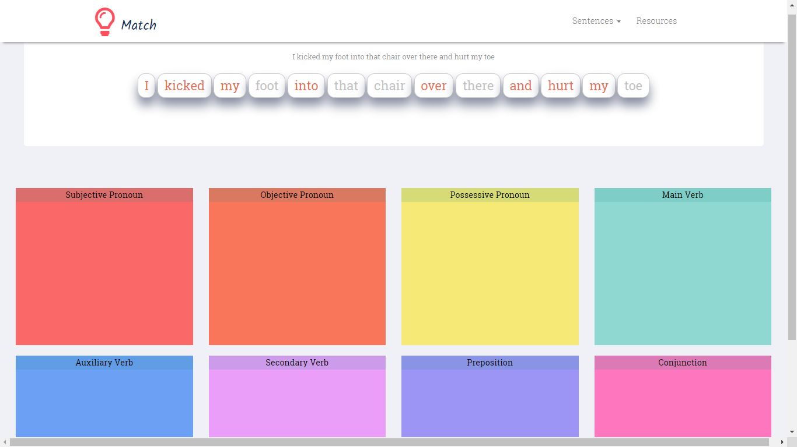

# Parts-Of-Speech
Responive Web UI Mockup where the user must identify the parts of speech and drag-drop the words in the designated area.  
Developed under **Information Technology Sevices, Old Dominion University**.

## Technologies
AWS EC2 Service, jQuery UI, jQuery, JavaScript, HTML, CSS, AJAX

### Image

